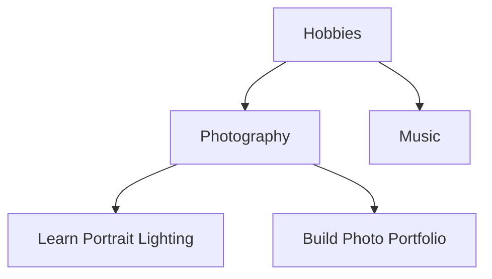

# Roadmap

This document outlines planned and potential future enhancements for the Recursive Goals plugin. Features are organized by category and priority.

---

## Views & Visualization

### Goal Tree View
**Priority:** High | **Complexity:** High

A custom sidebar view showing the goal hierarchy as an expandable tree.

- Expandable/collapsible tree structure
- Progress indicators (percentage or bar)
- Status icons (checkmark, clock, warning)
- Click to open goal files
- Drag and drop to reorganize hierarchy
- Filter by status, root goal, or date range

### Progress Bars
**Priority:** Medium | **Complexity:** Low

Add visual progress bar as computed property.

```yaml
_progressBar: "████████░░ 80%"
```

- Configurable bar length (10, 20 characters)
- Different styles (blocks, dots, ASCII)
- Color hints via emoji: 🟩🟩🟩🟩⬜⬜

### Mermaid Diagram Export
**Priority:** Medium | **Complexity:** Medium

Command to generate Mermaid flowchart of goal hierarchy.



- Export to clipboard or new note
- Include progress percentages
- Color code by status
- Embeddable in notes

### Calendar Heatmap
**Priority:** Low | **Complexity:** High

Visual calendar showing goal activity and deadlines.

- Heatmap of progress updates
- Deadline markers
- Completion celebrations

---

## Automation

### Goal Templates
**Priority:** High | **Complexity:** Medium

Auto-apply template when creating files in goals folder.

- Configurable template path
- Variable substitution (date, parent goal)
- Different templates for root vs child goals
- Template picker on creation

### Quick Goal Command
**Priority:** High | **Complexity:** Low

Command to create child goal from current file.

- "Create child goal" command
- Prompts for goal name
- Auto-links to current file as parent
- Creates in same folder
- Opens new file for editing

### Quick Progress Update
**Priority:** Medium | **Complexity:** Low

Command to quickly update progress without opening file.

- "Update goal progress" command
- Slider or input for percentage
- Works from any file mentioning the goal
- Keyboard shortcut support

### Auto-Archive Completed Goals
**Priority:** Medium | **Complexity:** Medium

Automatically move completed goals to archive folder.

- Configurable archive folder
- Delay after completion (immediate, 1 day, 1 week)
- Preserve hierarchy in archive
- "Unarchive" command to restore

### Recurring Goals
**Priority:** Low | **Complexity:** High

Support for recurring/repeating goals.

- Daily, weekly, monthly, yearly recurrence
- Auto-reset progress on schedule
- Track completion streaks
- History of past completions

---

## Analytics & Reporting

### Statistics Dashboard
**Priority:** High | **Complexity:** Medium

Command to show overall goal statistics.

- Total goals count
- Breakdown: completed, in-progress, not-started, overdue
- Stats per root goal
- Average progress
- Goals completed this week/month
- Modal or dedicated note output

### Progress History
**Priority:** Medium | **Complexity:** Medium

Track progress changes over time.

```yaml
_progressHistory:
  - date: 2025-01-15
    progress: 25
  - date: 2025-01-22
    progress: 50
  - date: 2025-01-29
    progress: 75
```

- Configurable tracking frequency
- Limit history length
- Enable trend analysis
- Velocity calculations

### Weekly/Monthly Reports
**Priority:** Medium | **Complexity:** Medium

Auto-generate progress reports.

- Goals completed this period
- Progress made on active goals
- Upcoming deadlines
- Blocked goals summary
- Insert into daily/weekly note

### Burndown Chart Data
**Priority:** Low | **Complexity:** Medium

Export data for burndown/burnup charts.

- Track remaining work over time
- Compatible with charting plugins
- Project completion predictions

### Goal Velocity
**Priority:** Low | **Complexity:** Medium

Calculate progress velocity.

```yaml
_velocity: 5.2  # percent per week
_estimatedCompletion: "[[2025-03-15]]"
```

- Based on recent progress history
- Estimated completion date
- Velocity trends

---

## Dependencies & Relationships

### Goal Dependencies
**Priority:** High | **Complexity:** Medium

Support explicit dependencies between goals.

```yaml
dependsOn:
  - "[[Learn Basics]]"
  - "[[Buy Equipment]]"
```

- Auto-block goals with incomplete dependencies
- `_blockedByDependency: true` computed property
- `_unblockedDate` when dependencies complete
- Dependency graph visualization

### Related Goals
**Priority:** Low | **Complexity:** Low

Track related but not dependent goals.

```yaml
relatedTo:
  - "[[Similar Project]]"
```

- `_relatedGoals` computed property
- Bi-directional linking
- Suggestions based on tags/content

### Milestone Support
**Priority:** Medium | **Complexity:** Medium

Define milestones within goals.

- Milestone checkpoints with dates
- Track milestone completion
- Milestone-based progress calculation
- Celebration on milestone completion

---

## Organization & Navigation

### Tags Inheritance
**Priority:** Medium | **Complexity:** Low

Inherit tags from parent goals.

```yaml
_inheritedTags:
  - "#hobby"
  - "#2025"
```

- Configurable: inherit all or specific tags
- Useful for filtering in Bases
- Option to merge or replace

### Goal Shortcuts
**Priority:** Medium | **Complexity:** Low

Quick navigation commands.

- "Go to root goal" command
- "Go to parent goal" command
- "List child goals" command
- "Next actionable goal" (leaf with lowest chain priority)

### Smart Goal Search
**Priority:** Low | **Complexity:** Medium

Enhanced search for goals.

- Search by status, progress range, date range
- Filter by root goal
- Sort by chain priority, due date, progress
- Quick switcher integration

### Goal Bookmarks
**Priority:** Low | **Complexity:** Low

Bookmark frequently accessed goals.

- "Bookmark goal" command
- Quick access panel
- Separate from Obsidian bookmarks

---

## Notifications & Reminders

### Deadline Reminders
**Priority:** High | **Complexity:** Medium

Notifications for upcoming deadlines.

- Configurable reminder days (7, 3, 1 day before)
- Notice on Obsidian start
- Optional system notifications
- Snooze functionality

### Daily Goal Digest
**Priority:** Medium | **Complexity:** Medium

Summary of goals on startup.

- Goals due today/this week
- Overdue goals alert
- Progress since last session
- Suggested focus goals

### Overdue Alerts
**Priority:** Medium | **Complexity:** Low

Persistent alerts for overdue goals.

- Status bar indicator
- Count of overdue goals
- Click to show list
- Dismiss/snooze options

### Celebration Notifications
**Priority:** Low | **Complexity:** Low

Celebrate goal completion.

- Confetti animation on 100%
- Completion streak tracking
- Milestone celebrations
- Motivational messages

---

## Data & Integration

### Export to JSON/CSV
**Priority:** Medium | **Complexity:** Low

Export goal data for external analysis.

- Full hierarchy export
- Flat list export
- Include all computed properties
- Configurable fields

### Import Goals
**Priority:** Low | **Complexity:** Medium

Import goals from external sources.

- CSV import
- JSON import
- Todoist/Notion import
- Preserve hierarchy

### API/Webhook Support
**Priority:** Low | **Complexity:** High

Integration with external services.

- Webhook on goal completion
- REST API for progress updates
- Zapier/IFTTT integration
- Mobile app sync

### Daily Notes Integration
**Priority:** Medium | **Complexity:** Medium

Automatic daily note integration.

- List goals due today
- Progress update section
- Link completed goals
- Template variables for goals

### Calendar Plugin Integration
**Priority:** Low | **Complexity:** Medium

Integration with calendar plugins.

- Show goals on calendar
- Deadline visualization
- Date picker for expected dates

---

## User Experience

### Onboarding Wizard
**Priority:** Medium | **Complexity:** Medium

First-time setup wizard.

- Create goals folder
- Set up first root goal
- Explain property names
- Create sample hierarchy

### Goal Creation Wizard
**Priority:** Medium | **Complexity:** Medium

Guided goal creation.

- Step-by-step prompts
- Parent goal selector
- Priority suggestions
- Date picker

### Keyboard Shortcuts
**Priority:** Medium | **Complexity:** Low

Customizable keyboard shortcuts.

- Quick progress increment (+10%)
- Mark complete
- Toggle blocked
- Navigate hierarchy

### Context Menu Actions
**Priority:** Low | **Complexity:** Low

Right-click actions for goal files.

- Create child goal
- Mark complete
- Update progress
- View in tree

### Mobile Optimization
**Priority:** Medium | **Complexity:** Medium

Ensure full mobile compatibility.

- Touch-friendly commands
- Mobile-optimized tree view
- Swipe gestures
- Responsive settings

---

## Advanced Features

### Goal Weighting
**Priority:** Medium | **Complexity:** Low

Explicit weight property separate from priority.

```yaml
weight: 2.5
```

- Override priority-based weighting
- More granular control
- Useful for unequal child contributions

### Conditional Properties
**Priority:** Low | **Complexity:** High

Properties that depend on conditions.

```yaml
_urgency: high  # based on days remaining + priority
_focus: true    # suggested next action
```

- Configurable rules
- Custom computed properties
- Formula support

### Goal Cloning
**Priority:** Low | **Complexity:** Low

Clone goal with subtree.

- Duplicate entire hierarchy
- Update dates relatively
- Reset progress
- Useful for recurring projects

### Bulk Operations
**Priority:** Low | **Complexity:** Medium

Operate on multiple goals at once.

- Bulk progress update
- Bulk status change
- Bulk date shift
- Select via search/filter

### Version History
**Priority:** Low | **Complexity:** High

Track goal changes over time.

- Property change history
- Revert to previous state
- Diff view
- Audit log

### Multi-Vault Support
**Priority:** Low | **Complexity:** High

Sync goals across vaults.

- Shared goal hierarchies
- Cross-vault references
- Conflict resolution

---

## Performance & Reliability

### Background Processing
**Priority:** Medium | **Complexity:** Medium

Process goals in background worker.

- Non-blocking updates
- Progress indicator
- Cancel long operations

### Incremental Validation
**Priority:** Low | **Complexity:** Medium

Validate only changed goals.

- Faster validation
- Real-time issue detection
- Fix suggestions

### Backup & Restore
**Priority:** Low | **Complexity:** Low

Backup computed properties.

- Export current state
- Restore after issues
- Automatic backups

### Conflict Resolution
**Priority:** Low | **Complexity:** Medium

Handle sync conflicts gracefully.

- Detect conflicting changes
- Merge strategies
- User prompts for resolution

---

## Developer Features

### Plugin API
**Priority:** Low | **Complexity:** High

API for other plugins to interact with goals.

- Get goal hierarchy
- Update progress programmatically
- Subscribe to changes
- Custom computed properties

### Custom Computed Properties
**Priority:** Medium | **Complexity:** High

User-defined computed properties.

- JavaScript expressions
- Access to goal data
- Custom aggregations
- Saved formulas

### Debug Mode
**Priority:** Low | **Complexity:** Low

Enhanced debugging tools.

- Verbose logging
- Graph visualization
- Performance metrics
- Cache inspection

---

## Summary by Priority

### High Priority
1. Goal Tree View
2. Goal Templates
3. Quick Goal Command
4. Statistics Dashboard
5. Goal Dependencies
6. Deadline Reminders

### Medium Priority
1. Progress Bars
2. Mermaid Diagram Export
3. Quick Progress Update
4. Auto-Archive
5. Progress History
6. Weekly/Monthly Reports
7. Tags Inheritance
8. Daily Notes Integration
9. Onboarding Wizard
10. Goal Weighting
11. Background Processing
12. Custom Computed Properties

### Low Priority
1. Calendar Heatmap
2. Recurring Goals
3. Burndown Chart Data
4. Goal Velocity
5. Related Goals
6. Smart Goal Search
7. Goal Bookmarks
8. Celebration Notifications
9. Export/Import
10. API/Webhook Support
11. Various UX improvements

---

## Contributing

If you'd like to implement any of these features:

1. Open an issue to discuss the approach
2. Fork the repository
3. Create a feature branch
4. Submit a pull request

Contributions welcome!
